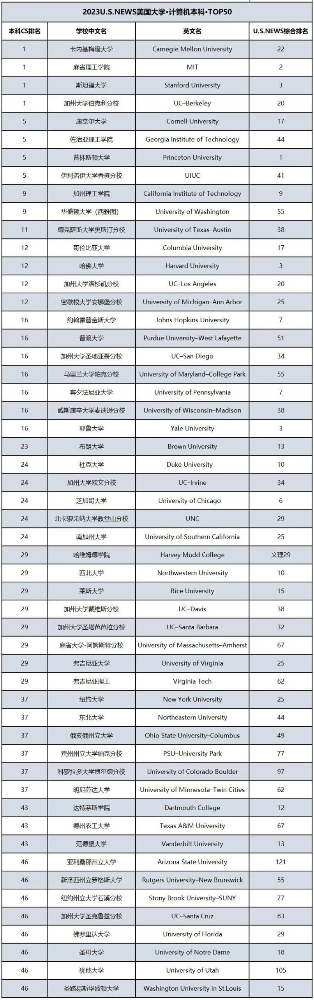

### 全美计算机本科排名

#### 人工智能专业 排名
1 卡耐基梅隆大学
2 麻省理工学院
3 斯坦福大学
4 加州大学伯克利分校
5 华盛顿大学
6 佐治亚理工学院
7 伊利诺伊大学香槟分校
8 康奈尔大学
9 加州理工学院
10 加州大学圣地亚哥分校

### 课程设置
#### 卡耐基梅隆大学 （速度相当快）
* 人工智能项目
http://coursecatalog.web.cmu.edu/schools-colleges/schoolofcomputerscience/artificialintelligence/#curriculumtext
15-112 Fundamentals of Programming and Computer Science -> 15-122 Principles of Imperative Computation -> 15-150 Principles of Functional Programming(需要数学基础) + 15-213 Introduction to Computer Systems -> 15-210 Parallel and Sequential Data Structures and Algorithms
07-180 Concepts in Artificial Intelligence(前置：15-112/15-122) -> 15-281 Artificial Intelligence: Representation and Problem Solving(还需矩阵论基础) -> 10-315 Introduction to Machine Learning (SCS Majors)(还需概率论基础) -> 
99-101 熟悉计算机工具
高年级细分方向：自然语言处理/计算机视觉
1. 15-112（2024 Spring）
https://www.cs.cmu.edu/~112/
找不到就近的homework和courses，quiz难度和讲授平衡（时间紧，only25min），范围:python基础、面向对象、游戏
2. 15-122 （难）
https://www.cs.cmu.edu/~15122/home.shtml
C语言(非常底层)，范围：数据结构到堆栈哈希排序树图，虚拟机，无除课件外资料
> 卡耐基梅隆的课都很难找，资料不公开，就不一个个找了orz
* 计算机项目
http://coursecatalog.web.cmu.edu/schools-colleges/schoolofcomputerscience/undergraduatecomputerscience/#bscurriculumtext
#### 麻省理工大学
https://catalog.mit.edu/degree-charts/computer-science-engineering-course-6-3/
先学python，除了基础计算机，会讲授软件开发注意的事项
#### 斯坦福大学
https://zhuanlan.zhihu.com/p/198953194
以C++开始学习，基础计算机课程（四件套+数据库、编译原理、并行计算）
#### 加州大学伯克利
https://eecs.berkeley.edu/cs/

